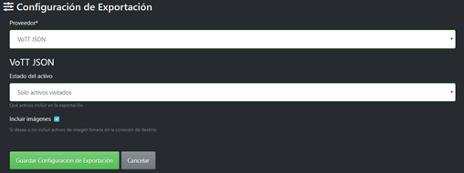

# Jetson NANO Training Custom Dataset
Step by step manual to start using the Jetson nano for AI applications, basic steps to set up for the first time, training your model in your own computer with your custom dataset and deploying your model in Jetson Nano.
## All you need to start (Hardware)
* [Jetson Nano 4GB Developer Kit](https://www.amazon.com.mx/nVidia-Jetson-Nano-Desarrollador-B01/dp/B084DSDDLT/ref=sr_1_1?__mk_es_MX=%C3%85M%C3%85%C5%BD%C3%95%C3%91&dchild=1&keywords=jetson+nano&qid=1618334404&sr=8-1)
*  [Micro SD minimum 64GB 100MB/s](https://www.amazon.com.mx/SAMSUNG-microSDXC-Tarjeta-Adaptador-MB-ME128HA/dp/B0887GP791/ref=sr_1_6?__mk_es_MX=%C3%85M%C3%85%C5%BD%C3%95%C3%91&crid=5LLIO2088IXV&dchild=1&keywords=mini%2Bsd%2Bcard%2B64%2Bgb&qid=1618334519&sprefix=mini%2Bsd%2Bcard%2Caps%2C202&sr=8-6&th=1)
*  [Cable Micro USB](https://www.amazon.com.mx/UGREEN-Trenzado-Cargador-Samsung-lectores/dp/B07VJMC4Z5/ref=sr_1_14?__mk_es_MX=%C3%85M%C3%85%C5%BD%C3%95%C3%91&crid=31EDU662858OT&dchild=1&keywords=cable+micro+usb&qid=1618334800&sprefix=cable+micro+%2Caps%2C212&sr=8-14)
*  [Keyboard and Mouse](https://www.amazon.com.mx/Logitech-MK220-Teclado-inal%C3%A1mbricos-espa%C3%B1ol/dp/B0080W1VVC/ref=sr_1_1?__mk_es_MX=%C3%85M%C3%85%C5%BD%C3%95%C3%91&crid=12PKP6HURCC2&dchild=1&keywords=keyboard+and+mouse&qid=1618335240&sprefix=keeyboard+a%2Caps%2C204&sr=8-1)
*  Monitor
*  [Webcam](https://www.amazon.com.mx/Logitech-C270-Webcam-720p-Negra/dp/B01BGBJ8Y0/ref=sr_1_22?__mk_es_MX=%C3%85M%C3%85%C5%BD%C3%95%C3%91&dchild=1&keywords=webcam&qid=1618335412&sr=8-22)
*  [Case with fan](https://www.amazon.com.mx/Yahboom-Carcasa-acr%C3%ADlico-Ventilador-refrigeraci%C3%B3n/dp/B07TH8NBWF/ref=sr_1_2?__mk_es_MX=%C3%85M%C3%85%C5%BD%C3%95%C3%91&dchild=1&keywords=case+jetson+nano&qid=1618335601&sr=8-2)
*  [HDMI](https://www.amazon.com.mx/Amazon-Basics-Trenzado-Velocidad-Oscuro/dp/B07S25XD8X/ref=sr_1_1_sspa?__mk_es_MX=%C3%85M%C3%85%C5%BD%C3%95%C3%91&dchild=1&keywords=HDMI&qid=1618335800&sr=8-1-spons&psc=1&spLa=ZW5jcnlwdGVkUXVhbGlmaWVyPUE1N0Q3TzlGVVdCVE0mZW5jcnlwdGVkSWQ9QTA0NDc3NzIyMkpDRk5BRkVBU0JMJmVuY3J5cHRlZEFkSWQ9QTAxMDk0MDAxTDg1OUtOWDc5Q0RKJndpZGdldE5hbWU9c3BfYXRmJmFjdGlvbj1jbGlja1JlZGlyZWN0JmRvTm90TG9nQ2xpY2s9dHJ1ZQ==)
*  [Ethernet](https://www.amazon.com.mx/UGREEN-Ethernet-Trenzado-10000Mbit-Compatible/dp/B086G7VHP3/ref=sr_1_6?__mk_es_MX=%C3%85M%C3%85%C5%BD%C3%95%C3%91&dchild=1&keywords=ethernet+cable&qid=1618336925&sr=8-6)
*  Computer

## Write Image to the microSD Card
To prepare your microSD card, you'll need a computer with internet connection and the ability to read and write SD cards, either via built-in SD card slot or adapter.
- Download the [Jetson Nano Developer Kit SD Card Image](https://developer.nvidia.com/jetson-nano-sd-card-image),and note where it was saved on the computer.
- Write the image to your microSD card
- Enter to this [link](https://developer.nvidia.com/embedded/learn/get-started-jetson-nano-devkit#write) and download the program for your operating system of your pc and follow the instructions.
- After your microSD card is ready, proceed to set up your developer kit.
## Setup and First Boot
- There are two ways to interactt with the developer kit:
  - with display, keyboard and mouse attached
  - in 'headless mode' via connection from another computer
- [Initial setup with display attached](https://developer.nvidia.com/sites/default/files/akamai/embedded/images/jetsonNano/gettingStarted/Jetbot_animation_500x282_2.gif)
- Unfold the paper stand and place inside the developer kit box
- Insert the microSD card (with system image already writteen to it) into the slot on the underside of the Jetson Nano module. [Example Image.](https://developer.nvidia.com/sites/default/files/akamai/embedded/images/jetsonNano/gettingStarted/Jetson_Nano-Getting_Started-Setup-Insert_microSD-B01.png)
- Set the developer kit on top of the paper stand.
- Power on your computer display and connect it.
- Connect the USB keyboard and mouse
- Connect your Micro-USB power supply (or see the [Jetson Nano Developer Kit User Guide](https://developer.nvidia.com/embedded/learn/get-started-jetson-nano-devkit#) for details about using DC a power supply with barrel jack connector). The developer kit will power on and boot automatically.
- First Boot, A green LED next to the Micro-USB connector will light as soon as the developer kit powers on. When you boot the first time, the developer kit will take you through some initial setup, including
- Review and accept NVIDIA Jetson software EULA
- Select system language, keyboard layout, and time zone
- Create username, password, and computer name
- Select APP partition size—it is recommended to use the max size suggested
- After logging in, You will see this [screen](https://developer.nvidia.com/sites/default/files/akamai/embedded/images/jetsonNano/gettingStarted/Jetson_Nano-Getting_Started-desktop.png). Congratulations!
- See and check the [Nvidia website](https://developer.nvidia.com/embedded/learn/get-started-jetson-nano-devkit#prepare) for more information
## Extra Step and Video Tutorial
- If you want to use the 'Headless Mode' follow thee tutorial on the [Nvidia website](https://developer.nvidia.com/embedded/learn/get-started-jetson-nano-devkit#setup)
- Here is the [video tutorial](https://www.youtube.com/watch?v=uvU8AXY1170), in the video is an extra step to use all the memory of your jetson, [minute 11:00](https://youtu.be/uvU8AXY1170?t=664).
## Install all libraries for IA in Jetson Nano
* A [video tutorial](https://www.youtube.com/watch?v=GA1EtjswpEk) to install all the neccesary tools for IA in Jetons
* Importan tools when making your own IA application [Here.](https://github.com/dusty-nv/jetson-inference)
## Create your Custom Dataset
- First, download the app for labeling your images, the app is [VOTT](https://github.com/microsoft/VoTT) a microsoft free and open source for image annotation and labeling
- Check the github for see the tutorials on how to start labeling your project. Here is a [video tutorial](https://www.youtube.com/watch?v=uXxE4Sas3uQ&t=2s).
- After you install the app, let's start downloading images in your folder connected to your project in vott. Also you can download videos and take frames for labeling (easiest way to labelling)After you install the app, let's start downloading images in your folder connected to your project in vott. Also you can download videos and take frames for labeling (easiest way to labelling)

- Finally, export your project in Vott JSON format

## Roboflow for Data Augmentation
- Create your account at [Roboflow](https://roboflow.com/).
- Next, create a new dataset

- Click on 'add images', select the folder where your dataset has beem exported from Vott

- Then, choose the augmentation options of your preference

- Finally, click on 'generate'. Congratulations, you have successfully create your dataset

## Prepare Dataset for Training the Mobilenet-SSD
- Before training our neural network, we need to download this [file](https://drive.google.com/u/0/uc?id=1rKiFl4WwzcbQ4Qbs_y4MbU9IGI3dfzLS&export=download) in our own PC, then install the requirements file. When you finish you will see a folder like this.

- In the data folder you will download the dataset from roboflow, it is important that you download your data in Pascal VOC format.

- Unzip your data and prepare to train your model, it should look like this

- Open your anaconda prompt and go to the direction of the python script 'PrepareDataset.py'
- Enter this command into the console:

`$ python PrepareDataset.py --data=’FolderNameofYourData’ --name=’NameOfTheFolderToAllocateTTheTransformData’`
- Then find a file with the name ‘labels.txt’ in the new folder created by the python script, put the names in list of your labels and save it. 

-Perfect, our data is ready for training. Now open a new anaconda prompt and go to the pytorch-ssd folder and enter this command into the console:

`$ python train_ssd.py --dataset-type=voc --data=data/’PathYourDataset” --model-dir=models/’NameOfYourModel’ --batch-size=8 --workers=0 --epochs=1`
- Troubleshooting
  - Reduce the number of the batch size to 2 
  - To get better results increment the number epochs
- Finally, let's transform our model to ONNX format, this will optimize our model. In the same console we train the model, we will put this command:

`$ python onnx_export.py --model-dir=models/’NameOfYourModel’`
- Perfect, now save the .onnx  and the labels.txt file created in google Drive and download in your Jetson Nano.
## Running the model in your Jetson Nano
* Download your model.onnx and the labels.txt to /jetson-inference/python/training/detection/ssd/models/"YourModelName"/
* Run the docker container in the terminal

`$ cd jetson-inference`
`$ docker/run.sh`
* Run your model using the webcam 

`$ detectnet --model=models/"YourModelName"/yourfile.onnx --labels=models/"YourModelName"/labels.txt \
          --input-blob=input_0 --output-cvg=scores --output-bbox=boxes /dev/video0` 

